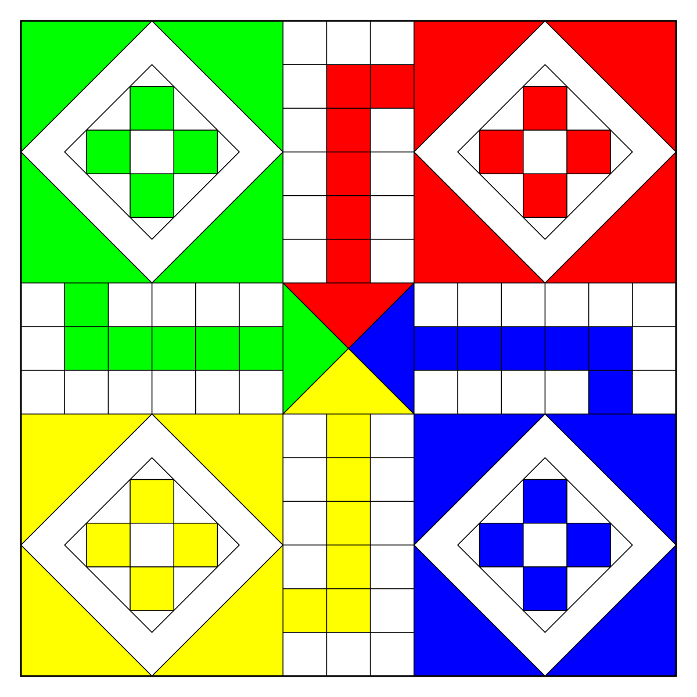

# [fit] IHF: Code
## [fit] Python — Making Games
### Live at 10am

---

# Send Code to
## uk-dlihfcode@kpmg.co.uk

---

# Questionnaire

---

# Make a Game

---

# Make a Game
- Beetle
- Rock, Paper, Scissors
- Number guessing game

---

# How games work
- Number of players
- Keep doing the same thing over and over until somebody wins

```python
def is_there_a_winner():
    # Work out if a player meets the rules to win or not
    pass

while not is_there_a_winner():
    # Play the game here
```

---

# Game Ideas
- Snakes and ladders
- Ludo
- Deal or No Deal
- Who wants to be a millionaire
- Top Trumps

---

# Snakes and ladders
- Board from 1 to 100
- Mulitple players
- If you land on different squares you move to other locations
- Winner if the first to get to position 100
- Think about how you could display a board

---

# Snakes and ladders

```python
100 99 98 97 96 95 94 93 92 91
...
...
...
21 22 23 24 25 26 27 28 29 30
20 19 18 17 16 15 14 13 12 11
1  2  3  4  5  6  7  8  9  10
```

---

# Snakes and ladders - Extras

- Randomly change the snakes and ladders
- Have ladders break after one player uses them

---

# Ludo
- 4 pieces to move around a board
- Think of the board as a straight line
- Each players home base starts at a different place on the line (1, 10, 20, 30)

---

# Ludo


---

# Ludo
```python
1   2   3   4  5  6  7  8  9  10
39                            11
38                            12
37                            R
B                             14
35                            15
34                            16
33                            17
32                            18
31                            19
30 29 28 27 26 25 24 23 22 21 20
```

---

# Ludo - Extras
- Knock people off the grid if you land on them
- Need to roll a 6 to start a piece
- Roll again if you get a 6
- Roll an exact number to get home
- 3 6's in a row and your piece returns home

---

# Deal or No Deal
- Set of boxes with values in (1p to £250,000)
- Player takes one box
- Player picks other boxes to reveal whats inside them
- Player ends up with their own box and one other box - they can then either keep their box or swap
- Player wins the value in their box

---

# Deal or No Deal
- Randomly assign the prize amounts to boxes (shuffle the list)
- Keep having the user pick a box to open until only 1 other box remains

---

# Deal or No Deal - Extras
- Replicate the banker to try and buy the box from the user

---

# Who wants to be a millionaire
- 15 questions
- Each question has 4 possible answers
- User has a set of life lines to help them (50/50, ask the audience, phone a friend)

---

# Who wants to be a millionaire - Extras
- How could you make an algorith for ask the audience or phone a friend?

---

# Top Trumps
- Set of cards that have a known set of attributes (strength, speed, power, magic, etc)
- Divide the set between the number of players
- Lead player picks an attribute from their top card and compares against all other users top card
- Winner takes all the cards and they go to the bottom of their pack
- Ultimate winner is the player who has all the cards

---

# Top Trumps
- Remember to shuffle the deck
- Make a deck of cards (list of dictionaries)
- Divide that list between multiple players
- Top card is index 0

---

# Top Trumps - Extras
- Keep a count of the winning cards to show the best card at the end
- If cards draw, put them all into a temporary pile and the next winning hand gets them all

---

# Extra Ideas
- Monopoly
- Battleships
- Cluedo
- Guess Who
- Chess
- Checkers

---

# Send Code to
## uk-dlihfcode@kpmg.co.uk

---

### Questions?
### go to sli.do #ihfcode

---

# [fit] Next Session
### Tuesday 4th August 10am
### Making Games Continued
